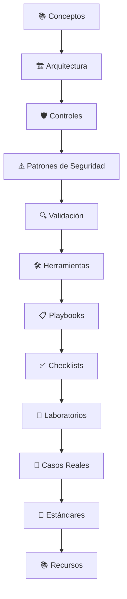

# 🛡️ Application Security

> Base de conocimiento práctica sobre **Application Security**, orientada a desarrolladores, ingenieros de seguridad y profesionales interesados en diseñar, desarrollar, revisar y proteger aplicaciones modernas.

---

## 👋 Bienvenido

Si llegaste aquí, este repositorio representa mi base de documentación técnica, ejemplos prácticos y recursos relacionados con **Application Security**.

Su objetivo es organizar el conocimiento desde una perspectiva práctica, conectando conceptos, controles de seguridad, patrones, herramientas y laboratorios para facilitar su comprensión y aplicación en escenarios reales.

Cada documento fue elaborado con el objetivo de explicar **qué es**, **por qué es importante**, **cómo se aplica** y **cómo se relaciona** con el resto de los temas del repositorio.

---

# 📊 ¿Qué vas a encontrar?

📚 **Guías Técnicas**  
Conceptos, principios y buenas prácticas de Application Security.

🧪 **Laboratorios Prácticos**  
Escenarios diseñados para comprender vulnerabilidades y validar controles de seguridad.

🛡️ **Patrones de Seguridad**  
Vulnerabilidades, malas prácticas, ejemplos seguros y estrategias de mitigación.

📋 **Playbooks**  
Guías paso a paso para realizar actividades habituales de Application Security.

✅ **Checklists**  
Listas de verificación para revisiones técnicas y procesos de seguridad.

🛠️ **Herramientas**  
Análisis de herramientas utilizadas durante el ciclo de vida de una aplicación.

📖 **Casos Reales**  
Análisis técnico de vulnerabilidades e incidentes que marcaron la industria.

🔄 **Proyecto en evolución**  
Repositorio actualizado continuamente con nuevo contenido y mejoras.

---

# 🗺️ Mapa del conocimiento#

---

# 🧭 Explorar el repositorio

| Sección | Descripción |
|----------|-------------|
| 📚 **Conceptos** | Fundamentos y principios sobre los que se construye la seguridad de las aplicaciones. |
| 🏗 **Arquitectura** | Diseño seguro de aplicaciones antes de comenzar el desarrollo. |
| 🛡 **Controles** | Mecanismos utilizados para proteger aplicaciones y reducir riesgos. |
| ⚠ **Patrones de Seguridad** | Vulnerabilidades, malas prácticas y estrategias de mitigación. |
| 🔍 **Validación** | Métodos para verificar la seguridad de una aplicación. |
| 🛠 **Herramientas** | Herramientas utilizadas durante el ciclo de vida de Application Security. |
| 📋 **Playbooks** | Procedimientos paso a paso para actividades habituales de AppSec. |
| ✅ **Checklists** | Listas de verificación reutilizables para revisiones técnicas. |
| 🧪 **Laboratorios** | Escenarios prácticos para poner en práctica los conocimientos. |
| 📖 **Casos Reales** | Análisis técnico de incidentes y vulnerabilidades conocidas. |
| 📐 **Estándares** | Marcos de referencia utilizados por la industria. |
| 📚 **Recursos** | Bibliografía, documentación oficial y material recomendado. |

---

# 💡 Filosofía del proyecto

La seguridad de una aplicación no depende únicamente de detectar vulnerabilidades.

Comprender **por qué ocurren**, **cómo prevenirlas**, **qué controles las mitigan** y **cómo validarlas** es lo que permite construir software más seguro.

Este repositorio busca organizar ese conocimiento de forma clara, consistente y reutilizable.

Cada documento se relaciona con otros conceptos del repositorio para construir una base de conocimiento interconectada.

---

## ⭐ ¿Te resultó útil?

Si este proyecto te resulta útil, podés marcar el repositorio con una ⭐ para seguir su evolución.

Toda sugerencia o corrección es bienvenida
